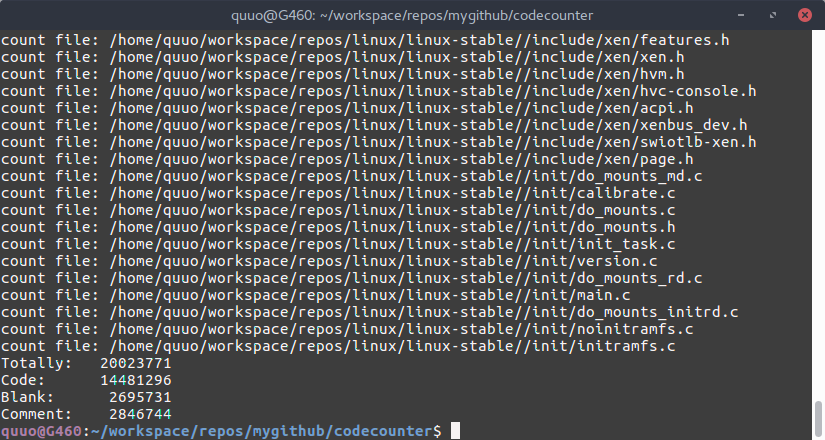

codecounter
===========
用于代码统计的命令行工具。该工具统计你的项目中源码，注释，以及空行的行数。

screenshot
----------
下图是统计的 linux 4.7 的源码树：
+ 总计 2002万行
+ 代码 1448万行
+ 空行 270万行
+ 注释 285万行
 

usage
-----
1. `git clone https://github.com/quanzhuo/codecounter.git`
2. `cd codecounter`
3. `make`
4. `./codecounter your_project_path`
